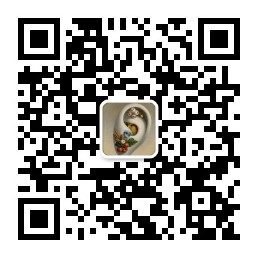

# hyperframes-skill-refs

Companion reference docs for the **HyperFrames** skill used inside Claude Code / Cursor / Codex.

Seven topic files that the upstream skill package (`heygen-com/hyperframes`) distributes through its website rather than bundling with the skill itself. Having them as local markdown lets an agent load them on demand without a web fetch.

## Why this exists

When you install HyperFrames skills with `npx skills add heygen-com/hyperframes`, the package ships composition rules, house style, transitions, palettes, and so on — but **not** the pages under *Getting Started / Guides / Concepts* that live only on the docs site ([hyperframes.heygen.com](https://hyperframes.heygen.com)).

This repo mirrors those pages as plain markdown, rewritten in an "agent-friendly" shape (short lead, tables preserved, trigger sentences for "read when…") and wired into a `SKILL.md` index via a *References* section.

## What's inside

| File | Mirrors |
| --- | --- |
| [`references/introduction.md`](references/introduction.md) | [`/introduction`](https://hyperframes.heygen.com/introduction) |
| [`references/quickstart.md`](references/quickstart.md) | [`/quickstart`](https://hyperframes.heygen.com/quickstart) |
| [`references/prompting.md`](references/prompting.md) | [`/guides/prompting`](https://hyperframes.heygen.com/guides/prompting) |
| [`references/rendering.md`](references/rendering.md) | [`/guides/rendering`](https://hyperframes.heygen.com/guides/rendering) |
| [`references/performance.md`](references/performance.md) | [`/guides/performance`](https://hyperframes.heygen.com/guides/performance) |
| [`references/troubleshooting.md`](references/troubleshooting.md) | [`/guides/troubleshooting`](https://hyperframes.heygen.com/guides/troubleshooting) |
| [`references/frame-adapters.md`](references/frame-adapters.md) | [`/concepts/frame-adapters`](https://hyperframes.heygen.com/concepts/frame-adapters) |

Each file's frontmatter carries the source URL. Content — tables, CLI flags, code examples — is derived from the upstream docs and reorganized for agent consumption; the underlying facts, commands, and API signatures are authored by the HyperFrames team.

## How to use it with the HyperFrames skill

Drop the `references/` folder into `~/.agents/skills/hyperframes/references/` (or its symlink `~/.claude/skills/hyperframes/references/`), then add the corresponding indirection lines to the skill's `SKILL.md` so an agent loads them on demand. For example:

```md
- **[references/prompting.md](references/prompting.md)** — Cold/Warm start shapes, vocabulary tables, anti-patterns.
  Read when briefing an agent or when output drifts from intent.
```

Heads up: `~/.agents/skills/hyperframes/` is managed by `npx skills` and **will be overwritten on update**. Keep this repo as your source of truth and re-copy after skill upgrades.

## Attribution & license

- **Upstream project:** [heygen-com/hyperframes](https://github.com/heygen-com/hyperframes) — the HyperFrames framework, docs, and skill package. © HeyGen, Inc. Licensed under **Apache License 2.0**.
- **Upstream docs site:** [hyperframes.heygen.com](https://hyperframes.heygen.com)
- **This repo:** the markdown in `references/` is a derivative work of the upstream docs, restructured for agent use. Released under the **same Apache 2.0 license** (see [`LICENSE`](LICENSE)).
- **Changes from upstream:** summarized in [`NOTICE`](NOTICE).

Nothing here claims to be an official HyperFrames product. For authoritative docs always check [hyperframes.heygen.com](https://hyperframes.heygen.com).

## Contributing

Spotted drift from the upstream docs? Open a PR replacing the offending file with the current upstream content (preserve the frontmatter source URL), or file an issue.

---

## 📱 关注作者 / Follow Me

如果这个仓库对你有帮助，欢迎关注我。后面我会持续更新更多 AI Skill、视频生成工作流、提示词系统和创意工具。

If this repo helped you, follow me for more AI skills, video generation workflows, prompt systems, and creative tooling.

- X (Twitter): [@xiaoerzhan](https://x.com/xiaoerzhan)
- 微信公众号 / WeChat Official Account: 扫码关注 / Scan to follow

<p align="center">
  
</p>

<p align="center"><strong>中文：</strong>欢迎关注我的公众号，一起研究 AI Skill、视频生成、提示词组织和创意工作流。</p>

<p align="center"><strong>English:</strong> Follow my WeChat Official Account for more AI skills, video generation workflows, prompt systems, and creative tooling.</p>
